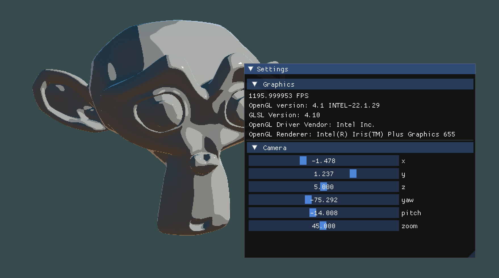

# glToonShader

## Overview
Toon shading, also known as cel shading, is a rendering technique used in computer graphics to give a 3D scene a stylized, cartoon-like appearance. Unlike traditional shading methods that aim for realistic lighting and shadows, toon shading simplifies the lighting model to create a more flat, graphic look reminiscent of traditional hand-drawn animation.

## Prerequisites
+ [CMake](http://www.cmake.org "CMake project page") (>= 3.20)
+ [SDL2](https://www.libsdl.org "Simple DirectMedia Layer") (>= 2.24.1)
+ [OpenGL](https://www.opengl.org "OpenGL project page") (>= 4.1)
+ [Assimp](https://assimp.org "Open Asset Import Library")
## License
glToonShader is licensed under the MIT License.
